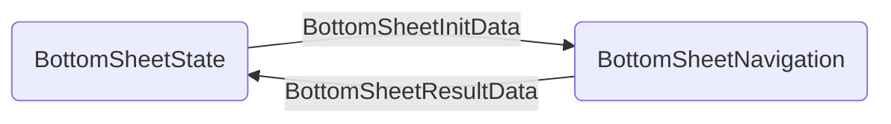

# bottomsheet
Jetpack Compose でボトムシートの状態管理、どうするのが正解なんだろう、、、

- BottomSheetState / rememberBottomSheetState
  - UIにわたす初期値や、ユーザーが操作した結果を返す
  - 状態を保持する
- BottomSheetInitData
  - UIの描画に必要な初期値
- BottomSheetResultData
  - ユーザーの入力した結果を返す
- BottomSheetNavigation
  - BottomSheetのUIを描画する
  - BottomSheetState から状態をもらって、UIを構築する

